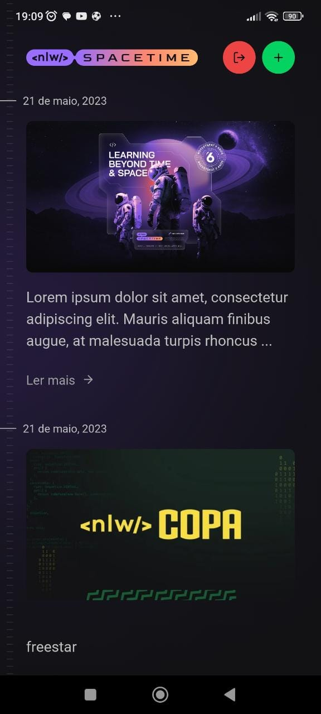

<h1 align="center">Mobile NLW SpaceTime</h1>

O servidor da NLW SpaceTime foi criado durante o evento da Rocketseat no período dos dias 15 a 19 de maio de 2023. A ideia da aplicação era criar uma cápsula do tempo onde uma pessoa poderia criar uma memória/lembrança e adicionar na sua conta.

 

# 🚀 Tecnologias

Projeto desenvolvido com as seguintes tecnologias:

- React Native
- TypeScript
- Expo
- Nativewind
- Axios

 

<h2>Versão Mobile:</h2> 

